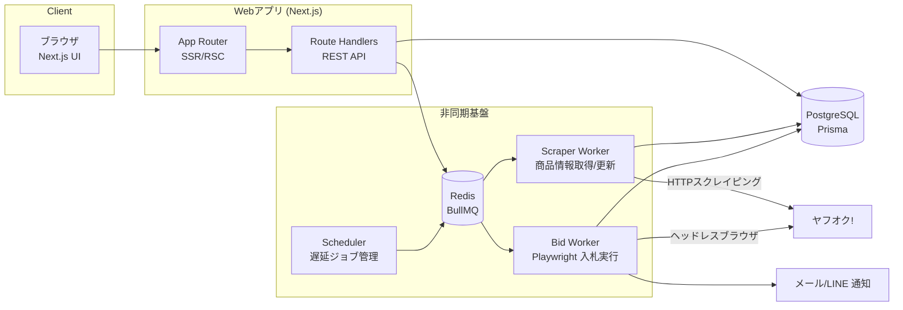
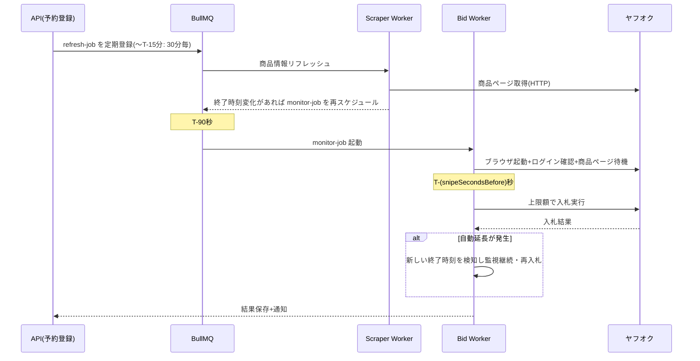

# ヤフオク落札予約(スナイプ入札)Webアプリ 設計書

作成日: 2026-08-22 / 最終更新: 2026-08-23 / ステータス: ドラフト(実装前レビュー用)

関連ドキュメント: [競合サービス分析(COMPETITORS.md)](./COMPETITORS.md) — オークファン入札予約・BidMachine 等の仕組み調査と設計への示唆

---

## 1. 概要

ヤフオク!(Yahoo!オークション)のオークション商品に対して、**終了直前に自動で入札を実行する「入札予約(スナイプ入札)」** を提供するWebアプリケーション。

ユーザーは商品URLと上限金額・実行タイミングを登録するだけで、システムがオークション終了の数秒前に自動入札を行う。終了間際まで入札を隠すことで、競り上げ合戦を回避し、より安い価格での落札を狙う。

### 想定ユーザーと利用シーン

- 深夜・日中に終了するオークションに張り付けない個人ユーザー
- 中古品の仕入れを行う小規模事業者(複数案件の同時管理)

---

## 2. 前提条件と重要なリスク

実装前に必ず合意しておくべき事項。

| 項目 | 内容 |
|---|---|
| 公式APIの不在 | Yahoo!オークションWebサービス(公式API)は既に提供終了。商品情報取得・入札はいずれも**Webスクレイピング+ブラウザ自動操作**に依存する |
| 利用規約リスク | ヤフオクのガイドラインは自動化ツールによるアクセスを制限している。**アカウント停止リスクがあることをユーザーに明示同意させる**(利用規約・登録フローに組み込む) |
| 認証情報の預かり | 入札実行にはユーザー本人のYahoo! JAPAN IDでのログインが必要。パスワードは預からず、**ログイン済みセッションCookieを預かる方式**を採用(後述 §8) |
| 2段階認証 / SMS認証 | ログイン再認証が発生すると自動入札が失敗する。セッション失効の検知と再連携依頼の通知が必須 |
| DOM変更への追従 | ヤフオク側のUI変更で入札フローが壊れる前提で、セレクタの外部設定化・障害検知・E2E監視を設計に含める |
| 責任範囲 | 入札失敗(回線・仕様変更・高値更新)による機会損失は補償しない旨を規約に明記 |

> ※ 本アプリは自己責任での利用を前提とする個人向けツールという位置づけ。商用展開する場合は法務レビューを別途行うこと。

---

## 3. 機能要件

### 3.1 MVP(フェーズ1)

| # | 機能 | 説明 |
|---|---|---|
| F-01 | ユーザー登録・ログイン | メール+パスワード(NextAuth.js / Auth.js) |
| F-02 | ヤフオクアカウント連携 | セッションCookieの登録と有効性チェック |
| F-03 | 入札予約の登録 | 商品URL貼り付け→商品情報自動取得→上限金額・実行秒数を設定 |
| F-04 | 商品情報の自動取得 | タイトル、現在価格、終了日時、画像、自動延長の有無、送料 |
| F-05 | 予約一覧・詳細 | ステータス(待機中/実行中/落札/敗北/失敗/キャンセル)表示 |
| F-06 | スナイプ入札の自動実行 | 終了N秒前(デフォルト30秒、5〜300秒で設定可)に入札。※最大手オークファンは「2分前」固定のため、秒単位指定自体が差別化点(COMPETITORS.md S-2) |
| F-07 | 自動延長対応 | 「自動延長あり」商品は延長を検知して再スナイプ(上限金額の範囲内) |
| F-08 | 結果通知 | メール通知(落札成功/敗北/実行失敗/セッション失効) |
| F-09 | 予約のキャンセル・編集 | 実行開始前まで可能 |

### 3.2 フェーズ2以降

- LINE通知 / Webプッシュ通知
- 終了時間の近い複数商品への「どれか1つ落札したら残りを自動キャンセル」グループ予約(BidSceneの条件付き入札に相当。需要の裏付けあり)
- **追跡入札モード**(自動延長あり商品限定): 上限額を一括で入れず「最高額入札者になれる最低額」で刻み、高値更新のたび上限額まで追随する。上限額を最後まで晒さない戦略(BidMachineの同名機能に相当)
- 入札履歴の統計(落札率、平均割引率)
- 商品ウォッチ(価格変動アラートのみ、入札なし)
- ブラウザ拡張によるワンクリック予約登録・Cookie自動連携

---

## 4. 全体アーキテクチャ



### 設計上のポイント

1. **Web層とWorker層の分離**: 入札実行は秒単位の精度が必要なため、Next.jsのリクエストライフサイクルから切り離し、常駐Workerプロセスで実行する。VercelのようなサーバーレスFaaSはスナイプ実行には不向きなので、**Worker はコンテナ常駐**とする。
   ただし置き場所は自由ではない。**ヤフオクはデータセンターIP(VPS / Cloud Run / Fly.io 等)からのアクセスを 403 で弾く**(他プロダクトで実測済み)。この制約は Worker だけでなく Web層にも掛かる — 予約登録とプレビューは Web プロセスから `fetchAuctionInfo()` を呼んでヤフオクを直接取得するため、Web だけをクラウドに分離することもできない。
   したがって **Web も Worker も住宅IPのマシン(Mac)で常駐させる**。外部から使いたい場合は「アプリをクラウドへ移す」のではなく「そのマシンへ到達させる」で解く(Tailscale 等。運用手順は README「外出先からアクセスする」)。
   代償として **マシンがスリープ・停止すれば入札は実行されない**。これは外から画面が開けるようになると「画面は正常なのに入札だけ起きない」という無症状の故障になるため、Worker は走査ごとに鼓動(`WorkerHeartbeat`)を打ち、Web は全ページ先頭で停止を警告する(§14.8)。
2. **ジョブキューは BullMQ(Redis)**: 「終了時刻の T-90秒 に起動する遅延ジョブ」をBullMQのdelayed jobで表現。Redisが落ちた場合に備え、予約の真実はDB(`BidReservation`)に持ち、Worker起動時にDBから遅延ジョブを再構築できるようにする(自己修復)。
3. **入札はPlaywright**: 入札確認画面の遷移が伴うためヘッドレスブラウザで実行。商品情報の定期取得は軽量なHTTPフェッチ+HTMLパースで行い、ブラウザ起動コストを掛けない。
4. **時刻同期**: WorkerホストはNTP同期必須。さらにヤフオクのサーバ時刻とのオフセットを定期計測し、スナイプ時刻計算に補正値を加える。

---

## 5. 技術スタック

既存リポジトリ(factoring-media)の構成を踏襲しつつ、新規リポジトリ/ディレクトリとして構築する。

| レイヤ | 技術 | 備考 |
|---|---|---|
| フロント/API | Next.js 16 (App Router) + TypeScript + Tailwind CSS 4 | 既存スタックと同一 |
| 認証 | Auth.js (NextAuth v5) | Credentials + メール確認 |
| DB | PostgreSQL + Prisma | 既存スタックと同一 |
| キュー | Redis + BullMQ | 遅延ジョブ・リトライ・レート制御 |
| ブラウザ自動化 | Playwright (Chromium) | 入札実行専用 |
| HTMLパース | cheerio | 商品情報取得 |
| 通知 | Nodemailer(SES等) → 将来 LINE Messaging API | 既存 `lib/notify.ts` の知見を流用 |
| 秘匿情報暗号化 | AES-256-GCM(Node `crypto`)+ KMS管理のマスターキー | Cookie保管用 |
| デプロイ | Docker Compose(web / worker / redis / postgres) | 既存Dockerfileの構成を流用 |

---

## 6. データモデル(Prisma スキーマ案)

```prisma
model User {
  id            String    @id @default(cuid())
  email         String    @unique
  passwordHash  String
  createdAt     DateTime  @default(now())
  updatedAt     DateTime  @updatedAt
  yahooSessions YahooSession[]
  reservations  BidReservation[]
  notifications Notification[]
}

// ヤフオクのログイン済みセッション(Cookie一式を暗号化して保管)
model YahooSession {
  id              String    @id @default(cuid())
  userId          String
  user            User      @relation(fields: [userId], references: [id])
  label           String                    // 表示名(例: メインアカウント)
  encryptedCookie String                    // AES-256-GCM 暗号化済みCookie JSON
  status          SessionStatus @default(ACTIVE) // ACTIVE / EXPIRED / INVALID
  lastVerifiedAt  DateTime?                 // 最終有効性チェック日時
  createdAt       DateTime  @default(now())
  updatedAt       DateTime  @updatedAt
  reservations    BidReservation[]
}

model BidReservation {
  id               String    @id @default(cuid())
  userId           String
  user             User      @relation(fields: [userId], references: [id])
  yahooSessionId   String
  yahooSession     YahooSession @relation(fields: [yahooSessionId], references: [id])

  auctionId        String                   // ヤフオクのオークションID (例: x1234567890)
  auctionUrl       String
  title            String
  imageUrl         String?
  sellerName       String?
  hasAutoExtension Boolean   @default(false) // 自動延長の有無
  endAt            DateTime                  // オークション終了予定日時(延長で更新される)
  originalEndAt    DateTime                  // 当初の終了日時

  maxBidAmount     Int                       // 上限入札額(円)
  snipeSecondsBefore Int     @default(30)    // 終了何秒前に入札するか(5〜300)
  currentPrice     Int?                      // 最終取得時の現在価格
  priceCheckedAt   DateTime?

  status           ReservationStatus @default(SCHEDULED)
  resultPrice      Int?                      // 落札価格(WONのとき)
  failureReason    String?                   // 失敗理由コード+詳細
  createdAt        DateTime  @default(now())
  updatedAt        DateTime  @updatedAt
  attempts         BidAttempt[]

  @@unique([userId, auctionId])              // 同一ユーザー×同一商品の二重予約防止
  @@index([status, endAt])                   // スケジューラの走査用
}

// 入札実行の試行ログ(自動延長で複数回実行される)
model BidAttempt {
  id             String   @id @default(cuid())
  reservationId  String
  reservation    BidReservation @relation(fields: [reservationId], references: [id])
  scheduledFor   DateTime           // 実行予定時刻
  executedAt     DateTime?          // 実際の実行時刻
  bidAmount      Int?               // 実際に入れた金額
  outcome        AttemptOutcome     // SUCCESS / OUTBID / PRICE_OVER_LIMIT / SESSION_EXPIRED / PAGE_ERROR / TIMEOUT
  detail         String?            // エラー詳細・スクリーンショットパス等
  createdAt      DateTime @default(now())
}

model Notification {
  id        String   @id @default(cuid())
  userId    String
  user      User     @relation(fields: [userId], references: [id])
  type      String                     // WON / LOST / FAILED / SESSION_EXPIRED など
  payload   Json
  sentAt    DateTime?
  createdAt DateTime @default(now())
}

enum SessionStatus { ACTIVE EXPIRED INVALID }

enum ReservationStatus {
  SCHEDULED   // 待機中
  MONITORING  // 終了間際の監視フェーズに入った
  BIDDING     // 入札実行中
  WON         // 落札
  LOST        // 高値更新され敗北
  FAILED      // システム都合で入札できず
  CANCELLED   // ユーザーによるキャンセル
  EXPIRED     // 上限額が現在価格を下回ったままスキップ終了
}

enum AttemptOutcome { SUCCESS OUTBID PRICE_OVER_LIMIT SESSION_EXPIRED PAGE_ERROR TIMEOUT }
```

---

## 7. スナイプ実行エンジンの設計(本アプリの核)

### 7.1 ライフサイクルとジョブ設計

1つの予約は次の3段階のジョブで処理する。



- **refresh-job(軽量・HTTP)**: 現在価格・終了時刻・早期終了/取り消しを定期確認。終了15分前までは30分間隔、以降5分間隔。現在価格が上限額を超えたら即座に `EXPIRED` にして通知(無駄なブラウザ起動を防ぐ)。
- **monitor-job(Playwright)**: **T-90秒に起動**してブラウザ・ログイン・入札ページを事前にウォームアップ。ここでセッション失効を検知したら即通知(ユーザーが間に合えば手動入札できる余地を残す)。
- **snipe実行**: サーバ時刻+ヤフオク時刻オフセット補正で `endAt - snipeSecondsBefore` ちょうどに入札確定ボタンまで進める。入札額は「現在価格+最低入札単位」ではなく**上限額そのまま**を入れる(ヤフオクは自動入札制なので、上限額を入れても支払額は競り相手+入札単位に収まる)。
- **実行タイミングの考え方(競合比較を踏まえて)**: 最大手オークファンは終了「2分前」固定で実行し、それでもサイト混雑起因の失敗(公式エラーコード991)を認めている。秒単位スナイプは差別化点である一方、遅延リスクをより強く負うため、デフォルトは安全側の30秒前とし、失敗時に手動入札の余地が残るようにする。ヘビーユーザーのみ5秒前まで詰められる設定とし、P0検証で秒数別の成功率を実測してデフォルト値を最終決定する。

### 7.2 自動延長への対応

ヤフオクの自動延長は「終了5分前以降に高値更新があると終了が5分延びる」仕様。

- `hasAutoExtension = true` の商品は、入札後も終了時刻をポーリング(2〜10秒間隔)し、延長を検知したら `endAt` を更新して同一 monitor-job 内で再スナイプループに入る。
- 高値更新されており、かつ次の必要額が `maxBidAmount` 以内なら再入札。超えていれば `LOST` 確定。
- 延長ループの上限(例: 最大30分 / 20回)を設け、暴走を防止する。

### 7.3 失敗時のフォールバック

| 事象 | 挙動 |
|---|---|
| セッション失効 | 即 `FAILED(SESSION_EXPIRED)` + 緊急通知(商品URLつき。手動入札を促す) |
| 入札ページのDOM不一致 | 1回だけ即時リトライ → 失敗ならスクリーンショット保存して `FAILED(PAGE_ERROR)` |
| 現在価格 > 上限額 | 入札せず `EXPIRED`(規定額オーバー)として通知 |
| Worker再起動 | 起動時に `status IN (SCHEDULED, MONITORING)` かつ `endAt` が近い予約をDBから走査してジョブを再構築 |
| Redis障害 | 予約データはDBが正。Redis復旧後にスケジューラが全件再登録 |

### 7.4 レート制御・ブロック回避(健全運用の範囲で)

- 同一ヤフオクセッションからの**入札送信**は直列化する(1アカウント1並列)。実装は `apps/worker/src/sessionLock.ts`。

  直列化するのは `placeBid()` の呼び出しだけで、monitor ジョブ全体ではない。monitor はウォームアップから自動延長ループまで最大30分走るので、ジョブ単位でロックを取ると、**同じアカウントで終了時刻の近い2件を予約した瞬間に片方が一度も入札されずに終わる**。

  待つのも無制限ではない。`sessionLockWaitMs()` が「終了時刻まで − 入札自体に要する 8 秒」を予算とし、最長 20 秒で打ち切る。取れなければ直列化を諦めて実行し、`console.warn` を出す(**入札しないより、並行してでも入札する**方がユーザーの損失が小さい)。

  ⚠️ ロックは worker プロセス内のメモリにしかない。worker を複数立てると直列化は効かない(Telegram の getUpdates も 1 プロセス排他なので、worker は1つで運用する)。
- refresh-jobのポーリング間隔は上記の通り控えめに設定し、対象外の商品を巡回しない。
- User-Agentは実ブラウザ相当を使用し、robots的に禁止された領域(検索クロール等)には手を出さない。**あくまで「ユーザー本人が行う操作の予約代行」の範囲に留める。**

---

## 8. ヤフオク認証情報の取り扱い

**パスワードは預からない。** ユーザーが自分のブラウザでログインした後のセッションCookieを登録してもらう方式とする。

1. 連携画面で Cookie 取得ヘルパー(`npm run yahoo:cookies`)を案内し、そこで得た `.yahoo.co.jp` ドメインの Cookie JSON をフォームに貼り付けてもらう。
   - **ブックマークレット方式は不可**(2026-08-24 に破棄)。ログイン維持に使う `T` / `Y` / `SSL` は httpOnly のため `document.cookie` からは見えず、ブックマークレットでは**認証 Cookie だけが欠けた JSON** が取れてしまう。形式は正しいので登録は通り、入札の瞬間に未ログインとして失敗する。
   - ヘルパーは専用プロファイルの Chromium を1つ開き、そこでログイン(2段階認証含む)を済ませてから Cookie を取り出す。普段使いの Chrome のプロファイルには触らない(`launch_persistent_context` を実プロファイルに向けると復元不能な破壊が起きる)。
   - 値はクリップボードにのみ入れ、画面・ファイルには出さない(出すのは名前・ドメイン・失効時刻だけ)。
2. サーバは受領後すぐに **AES-256-GCM で暗号化して `YahooSession.encryptedCookie` に保存**。マスターキーは環境変数ではなくKMS(またはDocker secret)で管理し、DBダンプ単体では復号不能にする。
3. 保存直後と以後6時間ごとに軽量リクエストで有効性チェック(`lastVerifiedAt` 更新)。失効検知時は `EXPIRED` にして再連携を促す通知。
4. 復号はBid Worker / Scraper Workerのメモリ上のみ。ログ・スクリーンショットにCookieが写り込まないようマスキングを徹底。
5. ユーザーによる連携解除時は即時レコード削除(論理削除にしない)。

---

## 9. API設計(Route Handlers)

すべて `/api/v1` 配下、認証はAuth.jsセッション必須。

| メソッド | パス | 説明 |
|---|---|---|
| POST | `/auth/register` `/auth/login` | 会員登録・ログイン(Auth.js標準) |
| GET | `/yahoo-sessions` | 連携済みセッション一覧(Cookie本体は返さない) |
| POST | `/yahoo-sessions` | Cookie登録 → 即時有効性チェック → 結果返却 |
| DELETE | `/yahoo-sessions/:id` | 連携解除 |
| POST | `/auctions/preview` | 商品URLを受けて商品情報をプレビュー取得(予約前確認用) |
| GET | `/reservations` | 予約一覧(status / 終了日時でフィルタ・ソート) |
| POST | `/reservations` | 予約登録。バリデーション: URL形式、終了済みでない、上限額 > 現在価格、同一商品の重複なし |
| GET | `/reservations/:id` | 詳細(BidAttemptログ含む) |
| PATCH | `/reservations/:id` | 上限額・実行秒数の変更(`SCHEDULED` のときのみ) |
| DELETE | `/reservations/:id` | キャンセル(`MONITORING` 開始前まで) |
| GET | `/reservations/:id/attempts` | 実行ログ |

- 予約登録・変更は終了60秒前を過ぎたら拒否(実行系との競合防止)。
- Worker→DB直接書き込みのため内部APIは設けない。Web側はDBポーリング(一覧画面)+必要ならSSEで詳細画面のライブ更新(フェーズ2)。

---

## 10. 画面設計

```
/                     ランディング(サービス説明・リスク明示・登録導線)
/login /register      認証
/dashboard            予約一覧(メイン画面)
/reservations/new     予約登録(URL貼付 → プレビュー → 上限額入力)
/reservations/[id]    予約詳細(状態・実行ログ・タイムライン)
/settings             設定トップ(各設定への入口と現在値の要約)
/settings/yahoo       ヤフオク連携管理
/settings/notifications 通知設定(Telegram chat ID・リマインド・稼働サマリ)
/settings/judgement   判断材料の設定(出品者の足切りしきい値)
/watchlist            ヤフオクのウォッチリスト(取り込み・そこから予約)
```

> 実装では `/settings/notify` ではなく `/settings/notifications` を採用した(2026-08-25)。

### 主要画面のポイント

- **ダッシュボード**: 「終了が近い順」がデフォルト。ステータスバッジ(待機中=グレー、実行中=青パルス、落札=緑、敗北=黄、失敗=赤)。終了までのカウントダウン表示。
- **予約登録**: URL貼り付け→ `POST /auctions/preview` で商品カードを即時表示→上限額入力時に「現在価格より高い額」をバリデーション。自動延長ありの商品には挙動説明を表示。確定前に「商品名・上限額・実行時刻」の確認ステップを挟み、誤発注を防ぐ(オークファンは確定時に自サービスのパスワード再入力を課している。当方は確認画面+上限額の再表示で代替)。**「自動入札はアカウント停止リスクがあります」の同意チェックボックスを毎回ではなく初回に取得。**
- **予約詳細**: BidAttemptを時系列表示。失敗時はスクリーンショット(S3等に保存)を確認できる。

---

## 11. 非機能要件

| 項目 | 目標 |
|---|---|
| スナイプ精度 | 目標時刻 ±1秒以内(NTP+オフセット補正) |
| 同時実行 | 同一時刻帯の終了商品 20件を並列処理可能(Playwrightコンテキストをプール) |
| 可用性 | Worker死活監視(healthcheck + 自動再起動)。終了5分前〜終了後の予約があるのにWorkerが停止していたらアラート |
| 監視 | 毎日1回、ダミー商品ページでスクレイパのE2Eテストを実行し、DOM変更を早期検知 |
| ログ | 構造化ログ(pino)。Cookie・個人情報はマスク |
| バックアップ | PostgreSQL 日次スナップショット |

---

## 12. ディレクトリ構成(モノレポ)

```
yahoo-auction-reserve/
├── apps/
│   ├── web/                  # Next.js (UI + API Route Handlers)
│   │   ├── app/
│   │   │   ├── (marketing)/          # LP・規約
│   │   │   ├── (app)/dashboard/
│   │   │   ├── (app)/reservations/
│   │   │   ├── (app)/settings/
│   │   │   └── api/v1/
│   │   └── lib/
│   └── worker/               # 常駐Worker (BullMQ consumer)
│       ├── src/
│       │   ├── jobs/refresh.ts       # 商品情報更新
│       │   ├── jobs/monitor.ts       # スナイプ本体
│       │   ├── scraper/              # cheerioパーサ(セレクタは設定ファイル化)
│       │   ├── bidder/               # Playwright入札フロー
│       │   └── scheduler.ts          # DB→ジョブ再構築
├── packages/
│   ├── db/                   # Prisma schema + client(web/worker共用)
│   └── shared/               # 型・定数・暗号化ユーティリティ
├── docker-compose.yml        # web / worker / postgres / redis
└── docs/
```

---

## 13. 開発フェーズとマイルストーン

| フェーズ | 内容 | 完了条件 |
|---|---|---|
| P0: 技術検証(1週) | Playwrightで実際に手動セッションCookieを使い1件入札できることを確認。商品ページのパース実装 | 実オークションでのスナイプ成功 |
| P1: MVP(3〜4週) | §3.1 の F-01〜F-09。Docker Composeで一式起動 | 自分たちで日常利用できる |
| P2: 運用強化(2週) | 自動延長の実戦テスト、E2E監視、エラー通知、スクリーンショット保存 | 1週間の無人運用で致命的失敗ゼロ |
| P3: 拡張 | LINE通知、ブラウザ拡張、グループ予約、統計 | — |

### 最初に潰すべき不確実性(P0で検証すること)

1. Cookie方式でログイン状態がどの程度の期間維持されるか(実測)
2. 入札確定までのページ遷移数と所要時間。実行秒数(5/10/30/60/120秒前)ごとの入札成功率を実測し、デフォルト値を決定(オークファンの「混雑時は失敗する」実績を踏まえる)
3. 自動延長発生時のDOM挙動(終了時刻の取得方法)
4. ヘッドレスブラウザがbot検知に引っかからないか(headless: false + Xvfb が必要かの判断)

#### P0 実測結果(2026-08-28 / `--stage2 --amount 5000` で確認画面まで到達)

上記 2 のうち「ページ遷移数と所要時間」は確定した。

- **ページ遷移は 0 回**。商品ページ → 入札フォーム → 確認画面の3画面すべてが
  **同じ URL のモーダル**。「遷移したから次の画面だ」という判断材料は最後まで無い。
- 確認画面に着いた positive な証拠は **入札額の入力欄(`#inputPrice`)が
  DOM から消えること** だけ(input 12個 → 11個)。
- 裏の商品ページの「入札する」ボタン2件は、確認画面表示中も DOM に残る。
  つまり `role=button[name="入札する"]` は確認画面でも2件当たる。
  **確定したつもりで裏のボタンを押し、入札していないのに成功報告になる**
  経路が実在する。確定前ガード(`submitTargetVerdict`)はこの4点を全部要求する:
  ボタンが見つかる / 入力欄が消えている / ラベルが商品ページ側でない /
  最初に押した入札ボタンと別要素。
- 確定ボタンの実ラベルは
  **「上記のガイドライン等、情報提供に同意して 入札する」**(id も name も無い `<button>`)。
- 所要時間: 入札ボタン 173ms / 入札額入力 19ms / 確認画面へ 125ms = **合計 317ms**。
  実行秒数の既定30秒前に対して十分小さいが、確定クリック自体の所要時間は未計測
  (実入札になるため P0 では押していない)。
- 入札額は「現在価格 +1円」では通らない。現在価格4,900円の回に4,901円を入れて
  弾かれた。最低は `現在価格 + 入札単位`(この帯は100円 → 5,000円)。
- ✅ **入札単位表は 2026-08-29 に確定**。ヤフオク公式ヘルプ「入札単位について」
  (https://support.yahoo-net.jp/PccAuctions/s/article/H000008793)の5行が
  `packages/shared/src/bidUnit.ts` の `BID_UNIT_TABLE` と境界を含めて完全一致した
  (1円〜10円 / 1,000円〜100円 / 5,000円〜250円 / 1万円〜500円 / 5万円〜1,000円)。
  同ヘルプの「『現在の価格』(入札者がいない場合)または『現在の価格＋入札単位』
  (入札者がいる場合)以上なら、1円単位で決められます」は、同日に入れた
  `minimumBidToBeat(currentPrice, bidCount)` の 0件分岐と「単位の倍数へ切り上げない」
  挙動の両方の裏取りになっている。
  ⚠️ ただし実測ではなく提供元ドキュメントによる裏取り。フォームの
  「最低入札価格」表示と食い違ったらフォーム側を正とする。

- ✅ **終了後の勝敗判定は商品ページでは取れない**(2026-08-29 実測 / n1242036522)。
  終了後の商品ページの状態表示は「このオークションは終了しています」の1行だけで、
  `wonIndicator` / `outbidIndicator` / `highestBidderIndicator` は**全滅**。落札者名も出ない。
  → 判定は **入札履歴ページ**(`/jp/show/bid_hist?aID=...`)へ移した。同ページには
  `ymb******** / 評価：238 最高額入札者 21 円` と
  `Royal Coin Japan / 評価：186 11 円` が並び、**自分の行だけ ID が伏字にならない**。
  ヘッダの `loggedInIndicator` と同じ表示名で自分の行を特定し、
  「最高額入札者」が付いているかで WON / LOST を決める(`bidder/bidHistory.ts`)。
  この1ページに WON 側と LOST 側の陽性対照が両方あった。
  ⚠️ 終了前のページにも「最高額入札者」は出るので、**終了後にだけ**呼ぶこと。
- ⚠️ 副産物: 旧 `checkResult` は構造上 **必ず UNKNOWN** を返し、monitor がそれを
  LOST に畳んでいた(= 落札しても「落札ならず」が届く)。UNKNOWN は FAILED として
  人間に上げる形に直した。
- ⚠️ 副産物2: 終了済みページでは「見た目が似ている商品」カルーセルの価格
  (現在1円 / 即決21,000円)が本文より先に現れる。パーサのテキストフォールバックは
  ページ全体を見るので、埋め込みJSONが欠けた時に**他人の出品の価格**を返しうる。

残る未検証: 確定クリックの実体(押すと取り消せないため人間の判断待ち)、
Cookie の維持期間、自動延長時の DOM 挙動、bot 検知、
**入札フォームの金額が税抜か税込か**(`price != taxinPrice` のストア出品で
`--stage2` を回し、フォームの「最低入札価格」と突き合わせる。これが取れるまで
`currentPrice` は税抜側=`price` のまま動かさない)。

---

## 14. 追補(2026-08-25 実装時の設計判断)

MVP 実装中に追加した機能と、その安全側の倒し方。**「取得できなかった」を
「問題なし」に丸めない**が全体を貫く方針。パーサが壊れた日に、判定だけが
静かに全通過するのを防ぐ。

### 14.1 判断材料(送料・落札相場・出品者評価)

| 項目 | 取得元 | null の意味 |
|---|---|---|
| `shippingFee` | 商品ページ(埋め込み JSON → テキストの順) | 不明。**0(送料無料)と区別する**。総額は「送料不明」と表示し、勝手に足さない |
| `shippingNote` | 「落札者負担」等、金額を確定できなかったときの原文 | — |
| `sellerRating` / `sellerRatingCount` | 同上 | 読めなかった。足切り判定は `unknown` になり、**ブロックしない** |
| `marketMedianPrice` / `marketSampleCount` | 落札済み検索(`closedsearch`)を enrich 走査で後追い | `marketSampleCount = 0` は「調べたが該当なし」、`null` は「取得失敗」 |

- 相場は予約登録の同期処理では取らない(登録が外部サイトの応答時間に引きずられる)。
  worker の `runEnrichSweep` が `marketCheckedAt = null` の予約を1回5件ずつ処理する。
- **失敗しても `marketCheckedAt` は必ず進める**。進めないと同じ1件を毎走査叩き続け、
  後ろの予約が永久に順番待ちになる(失敗は `marketSampleCount = null` で区別する)。
- `refresh` ジョブでの補完は「まだ入っていないときだけ」。毎回上書きすると、
  パーサが壊れた回の `undefined` で既に取れていた値を潰す。
- ⚠️ 送料・評価・相場のセレクタと `closedsearch` の URL は **P0 未検証のプレースホルダ**。
  実ページで確認するまで「取れない項目がある」前提で扱う(取れなければ表示しないだけで、
  予約の登録・実行そのものは止めない)。

### 14.2 出品者の足切り

`User.sellerRatingFloor` / `sellerRatingMinCount` / `blockLowRatedSeller`。

- 既定は **null(判定しない)**。しきい値を推測で埋めると、ユーザーからは
  「なぜか予約できない商品がある」という形でしか見えない。
- 判定は3値(`ok` / `warn` / `unknown`)。**`unknown` では絶対に止めない** —
  評価が読めなくなった日に全予約が登録不能になるため。
- ブロックするのは `warn` かつ `blockLowRatedSeller = true` のときだけ。
  OFF なら一覧・確認画面の警告表示にとどめる。
- 判定は `POST /reservations` だけでなく `POST /auctions/preview` でも返す。
  POST まで黙っていると「登録ボタンを押したら断られた」という体験になる。
- しきい値が1つも無いのにブロックだけ ON にする設定は API 側で断る(常に `ok` になり、
  設定画面からは有効に見えるのに永久に何も起きないため)。

### 14.3 グループ予約(§3.2 の前倒し実装)

`ReservationGroup`(`cancelOthersOnWin` 既定 true)に予約を束ね、1件落札したら
残りを `CANCELLED / GROUP_CANCELLED` にする。

- キャンセル対象は `SCHEDULED` / `MONITORING` のみ。**`BIDDING` は触らない** —
  こちらが取り消しても向こうで入札が成立している可能性があり、取り消せたつもりで
  二重落札する。飛ばした分は警告ログと通知に必ず出す(黙って残すと原因を追えない)。
- 状態遷移は `updateMany(where: { id, status })` で行い、直前に状態が変わっていたら
  skip として数える。

### 14.4 通知とウォッチリスト

- 通知は Telegram(新規 Bot)+ メール。イベントは終了 N 分前リマインド / 入札結果 /
  異常系 / 毎日の稼働サマリ(死活監視兼用)の4種。
- リマインドと稼働サマリは BullMQ の遅延ジョブに載せず、30 秒走査 + DB の一意制約で
  実現する。遅延ジョブに載せると、再起動で消えたリマインドが**二度と来ないのに
  正常に見える**。
- ウォッチリスト同期は **Yahoo → アプリの一方向**、60 分間隔。アプリ側からヤフオクの
  ウォッチリストは触らない。
- `/watchlist` の「予約しない」は行を消さず `dismissedAt` を立てる(消しても次の同期で
  復活するだけで、伏せた意味が無い)。
- 画面には**最終同期時刻を必ず出す**。同期が止まっているのに一覧が空だと
  「ウォッチが0件」に見えるが、実際はログイン切れやセレクタ崩れで読めていない。

### 14.5 API 追加分

| メソッド | パス | 説明 |
|---|---|---|
| GET / PUT | `/notification-settings` | 通知設定 |
| GET / PUT | `/judgement-settings` | 判断材料のしきい値 |
| GET / POST | `/groups` | グループ一覧・作成 |
| DELETE | `/watchlist/:id` | ウォッチリスト行を伏せる(`dismissedAt`) |

### 14.6 連携 Cookie の生存確認(§8-3 の実装方針)

登録時の検証は Cookie 名の構造チェックのみ。ログインが切れていても登録は通るので、
**切れていることが分かるのが入札の瞬間になる**。これを避けるため worker 側に定期確認を置く。

- 走査: `runVerifySessionSweep`(15分ごと)。実際に開くのは
  `lastVerifyAttemptAt` が6時間より古い ACTIVE な連携だけ、1回3件まで
- 順番は成功時刻(`lastVerifiedAt`)ではなく **試行時刻**(`lastVerifyAttemptAt`)で決める。
  成功時刻で並べると、失敗し続ける1件が毎回先頭に来て他が永久に確認されない。
  試行時刻はブラウザを開く前に立てる(例外で落ちても順番は回る)
- 判定は純粋関数 `judgeSession()` に隔離する(ブラウザ操作の中に if を書くと分岐を固定できない)

| 判定 | 根拠 | 処理 |
|---|---|---|
| `EXPIRED` | ログイン画面へのリダイレクト / `loginLink` の**存在** | 失効 + `SESSION_EXPIRED` 通知 |
| `ACTIVE` | `loginLink` 無し かつ `loggedInIndicator` 有り | `lastVerifiedAt` を進める |
| `UNKNOWN` | どちらも検出できない・取得失敗 | 何もしない |

**判定の非対称性(重要)**: 失効にするとその連携の予約が全部止まる。誤って失効に倒すコストが
大きいので、`loggedInIndicator` の **不在** は根拠にしない(ログイン中の1回でしか確認できておらず、
ヘッダの実装変更で「全セッション失効」に化ける)。陽性の証拠があるときだけ `EXPIRED` を出す。

その裏返しで、`UNKNOWN` が続くとこの確認は静かに何もしないのと同じになる。`UNKNOWN` では
`lastVerifiedAt` を進めないことで検出可能にし、24時間更新が無い ACTIVE 連携には日次サマリの
連携行に ⚠️ を付ける。これが唯一の異常サインなので消さないこと。

確認先 URL は 予約中の商品ページ → ウォッチリストの商品 → ヤフオクトップ の順。
ログイン有無の差を P0 で実測できているのは商品ページの `loginLink` だけのため。

### 14.7 ウォッチリストの P0 検証(`--watchlist`)

ウォッチリストの URL とセレクタは未検証。`npm run p0:probe -- --watchlist` は
`WATCHLIST_URL_CANDIDATES`(worker 本体と同じ配列を import)を順に開き、候補セレクタの
当たりに加えて **本番と同じ `scrapeWatchlistPage()` の返り値** をレポートに書く。

プローブ用の別ロジックで「当たった」と判断すると、本番コードだけ外れたままでも気づけない。
`--anonymous` を付けた回はログイン壁(`watchlistLoginWall`)の陽性対照になる。

### 14.8 worker の死活表示(2026-08-25 追補)

外出先アクセス(§4-1)を許した時点で、**「画面は開くのに入札が実行されない」が最も
起きやすい故障**になる。Mac のスリープ・再起動・docker 停止のいずれでも同じ症状になり、
UI 側には何の異常も出ない。

対策は鼓動 + 全ページ警告の2点。

| 層 | 実装 | 備考 |
|---|---|---|
| worker | `jobs/heartbeat.ts` — 走査(30秒)ごとに `WorkerHeartbeat` を1行上書き | 他の走査の成否に関わらず打つ |
| shared | `judgeWorkerLiveness()` — 最後の鼓動からの経過で `OK` / `STALE` / `NEVER` | しきい値 3分(走査6回分) |
| web | `app/WorkerAlert.tsx` — レイアウト直下で赤い警告を出す | DB が読めないときは何も出さない |

設計上の判断:

- **鼓動は「走査が回っていること」であって「ジョブが成功したこと」ではない。**
  ジョブ成功を鼓動にすると、予約が1件も無い日と worker が死んでいる日が区別できなくなる。
  逆に「全ジョブ成功時だけ打つ」にすると、1つのジョブが恒常的に失敗している間ずっと
  「worker 停止」と表示され、本当に止まった日の警告が信用されなくなる
- **判定は「分からないなら警告する」側に倒す**(鼓動が一度も無い = `NEVER` も警告)。
  連携 Cookie の失効判定(§14.6)が逆に「分からないなら何もしない」なのは、あちらの
  誤判定が再連携を強いる破壊的操作だから。こちらは表示が出るだけなので、
  見落とし(止まっているのに OK と出る)の方が高くつく
- **履歴を持たない**(1行の上書き)。30秒ごとの鼓動を貯めると1日 2,880 行になるが、
  生死判定に必要なのは最後の1点だけ

日次サマリ(Telegram)は「サマリが来ない日は止まっている」という**外側からの**死活監視、
この警告は「アプリを開いたときの」死活監視。片方だけでは、通知を見落とした日 /
アプリを開かない日に穴が空く。

### 14.9 テスト実行 / DRY_RUN(2026-08-28 追補)

P0(§13)で確かめたのは **プローブを手で叩いたときの画面** だけで、製品そのものの経路
——予約を登録して放置 → スケジューラ → 終了 N 秒前に worker が自前で起動 → Cookie 復号 →
セッションロック → 入札 → 通知—— は一度も通っていない。ここが MVP 最大の空白で、しかも
初回の実入札で初めて通ることになるため、失敗が **取り消せない場面** に集中する。

そこで `BidReservation.dryRun` を足し、**確定クリックだけを行わない実行**を用意する。

| 決めたこと | そうした理由 |
|---|---|
| 予約ごとの DB フラグ(環境変数にしない) | 全体スイッチだと「切り忘れて全予約が空振り」と「入れ忘れて実入札が飛ぶ」がどちらも全件に効く。フラグなら被害が1件に閉じる |
| 止める位置は `submitTargetVerdict` の **後** | 判定より前で返すと、確認画面に着けていないのに「テスト実行 成功」になる。テスト実行が一番確かめたいこと(本番なら正しいボタンを押せたか)を確かめないまま合格が出る |
| 終了状態 `ReservationStatus.DRY_RUN` を新設 | WON/LOST に混ぜると入札していない予約が落札結果として数えられる |
| 試行結果 `AttemptOutcome.DRY_RUN` を新設 | SUCCESS に混ぜると成功率が実態より高く出る |
| 通知区分 `NotificationCategory.TEST` を新設 | RESULT に入れると、結果通知を切っているユーザーがテスト実行したとき **何も届かないまま終わる**。動いていない場合と区別が付かない |
| `monitor.ts` の DRY_RUN 分岐は `!== "SUCCESS"` より前 | DRY_RUN は失敗ではないが `!== "SUCCESS"` は満たす。後ろに置くとリトライされ、2回目も DRY_RUN なので最終的に FAILED になる(全部正常に動いたのに失敗通知) |

テスト実行で確かめられること / 確かめられないこと:

- **確かめられる**: 予定時刻に本当に起動したか / 予定との遅れ(秒) / Cookie が生きているか /
  入札額の入力が通るか(最低入札価格を満たしているか) / 確認画面に到達できるか /
  4点ガードを全部通るか / 通知が届くか
- **確かめられない**: 確定ボタンを押した先。ここだけは実入札1件でしか埋まらない
