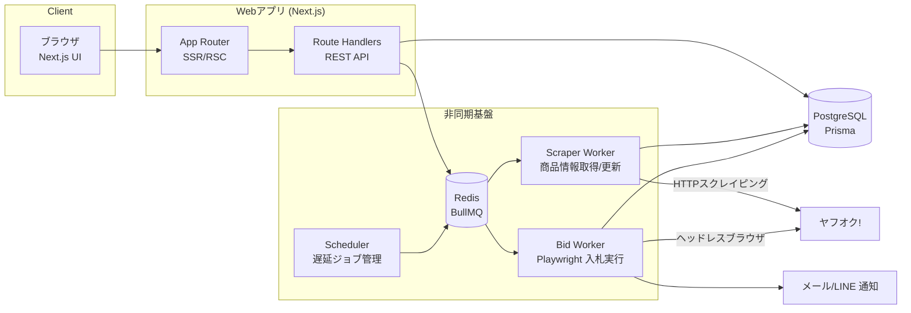
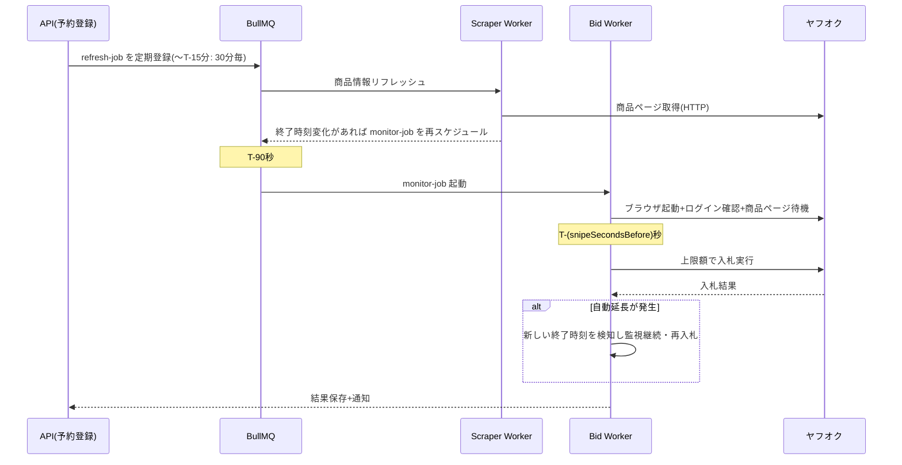

# ヤフオク落札予約(スナイプ入札)Webアプリ 設計書

作成日: 2026-08-22 / ステータス: ドラフト(実装前レビュー用)

---

## 1. 概要

ヤフオク!(Yahoo!オークション)のオークション商品に対して、**終了直前に自動で入札を実行する「入札予約(スナイプ入札)」** を提供するWebアプリケーション。

ユーザーは商品URLと上限金額・実行タイミングを登録するだけで、システムがオークション終了の数秒前に自動入札を行う。終了間際まで入札を隠すことで、競り上げ合戦を回避し、より安い価格での落札を狙う。

### 想定ユーザーと利用シーン

- 深夜・日中に終了するオークションに張り付けない個人ユーザー
- 中古品の仕入れを行う小規模事業者(複数案件の同時管理)

---

## 2. 前提条件と重要なリスク

実装前に必ず合意しておくべき事項。

| 項目 | 内容 |
|---|---|
| 公式APIの不在 | Yahoo!オークションWebサービス(公式API)は既に提供終了。商品情報取得・入札はいずれも**Webスクレイピング+ブラウザ自動操作**に依存する |
| 利用規約リスク | ヤフオクのガイドラインは自動化ツールによるアクセスを制限している。**アカウント停止リスクがあることをユーザーに明示同意させる**(利用規約・登録フローに組み込む) |
| 認証情報の預かり | 入札実行にはユーザー本人のYahoo! JAPAN IDでのログインが必要。パスワードは預からず、**ログイン済みセッションCookieを預かる方式**を採用(後述 §8) |
| 2段階認証 / SMS認証 | ログイン再認証が発生すると自動入札が失敗する。セッション失効の検知と再連携依頼の通知が必須 |
| DOM変更への追従 | ヤフオク側のUI変更で入札フローが壊れる前提で、セレクタの外部設定化・障害検知・E2E監視を設計に含める |
| 責任範囲 | 入札失敗(回線・仕様変更・高値更新)による機会損失は補償しない旨を規約に明記 |

> ※ 本アプリは自己責任での利用を前提とする個人向けツールという位置づけ。商用展開する場合は法務レビューを別途行うこと。

---

## 3. 機能要件

### 3.1 MVP(フェーズ1)

| # | 機能 | 説明 |
|---|---|---|
| F-01 | ユーザー登録・ログイン | メール+パスワード(NextAuth.js / Auth.js) |
| F-02 | ヤフオクアカウント連携 | セッションCookieの登録と有効性チェック |
| F-03 | 入札予約の登録 | 商品URL貼り付け→商品情報自動取得→上限金額・実行秒数を設定 |
| F-04 | 商品情報の自動取得 | タイトル、現在価格、終了日時、画像、自動延長の有無、送料 |
| F-05 | 予約一覧・詳細 | ステータス(待機中/実行中/落札/敗北/失敗/キャンセル)表示 |
| F-06 | スナイプ入札の自動実行 | 終了N秒前(デフォルト10秒、5〜60秒で設定可)に入札 |
| F-07 | 自動延長対応 | 「自動延長あり」商品は延長を検知して再スナイプ(上限金額の範囲内) |
| F-08 | 結果通知 | メール通知(落札成功/敗北/実行失敗/セッション失効) |
| F-09 | 予約のキャンセル・編集 | 実行開始前まで可能 |

### 3.2 フェーズ2以降

- LINE通知 / Webプッシュ通知
- 終了時間の近い複数商品への「どれか1つ落札したら残りを自動キャンセル」グループ予約
- 入札履歴の統計(落札率、平均割引率)
- 商品ウォッチ(価格変動アラートのみ、入札なし)
- ブラウザ拡張によるワンクリック予約登録・Cookie自動連携

---

## 4. 全体アーキテクチャ



### 設計上のポイント

1. **Web層とWorker層の分離**: 入札実行は秒単位の精度が必要なため、Next.jsのリクエストライフサイクルから切り離し、常駐Workerプロセスで実行する。VercelのようなサーバーレスFaaSはスナイプ実行には不向きなので、**Worker はコンテナ常駐(VPS / Cloud Run always-on / Fly.io 等)** とする。
2. **ジョブキューは BullMQ(Redis)**: 「終了時刻の T-90秒 に起動する遅延ジョブ」をBullMQのdelayed jobで表現。Redisが落ちた場合に備え、予約の真実はDB(`BidReservation`)に持ち、Worker起動時にDBから遅延ジョブを再構築できるようにする(自己修復)。
3. **入札はPlaywright**: 入札確認画面の遷移が伴うためヘッドレスブラウザで実行。商品情報の定期取得は軽量なHTTPフェッチ+HTMLパースで行い、ブラウザ起動コストを掛けない。
4. **時刻同期**: WorkerホストはNTP同期必須。さらにヤフオクのサーバ時刻とのオフセットを定期計測し、スナイプ時刻計算に補正値を加える。

---

## 5. 技術スタック

既存リポジトリ(factoring-media)の構成を踏襲しつつ、新規リポジトリ/ディレクトリとして構築する。

| レイヤ | 技術 | 備考 |
|---|---|---|
| フロント/API | Next.js 16 (App Router) + TypeScript + Tailwind CSS 4 | 既存スタックと同一 |
| 認証 | Auth.js (NextAuth v5) | Credentials + メール確認 |
| DB | PostgreSQL + Prisma | 既存スタックと同一 |
| キュー | Redis + BullMQ | 遅延ジョブ・リトライ・レート制御 |
| ブラウザ自動化 | Playwright (Chromium) | 入札実行専用 |
| HTMLパース | cheerio | 商品情報取得 |
| 通知 | Nodemailer(SES等) → 将来 LINE Messaging API | 既存 `lib/notify.ts` の知見を流用 |
| 秘匿情報暗号化 | AES-256-GCM(Node `crypto`)+ KMS管理のマスターキー | Cookie保管用 |
| デプロイ | Docker Compose(web / worker / redis / postgres) | 既存Dockerfileの構成を流用 |

---

## 6. データモデル(Prisma スキーマ案)

```prisma
model User {
  id            String    @id @default(cuid())
  email         String    @unique
  passwordHash  String
  createdAt     DateTime  @default(now())
  updatedAt     DateTime  @updatedAt
  yahooSessions YahooSession[]
  reservations  BidReservation[]
  notifications Notification[]
}

// ヤフオクのログイン済みセッション(Cookie一式を暗号化して保管)
model YahooSession {
  id              String    @id @default(cuid())
  userId          String
  user            User      @relation(fields: [userId], references: [id])
  label           String                    // 表示名(例: メインアカウント)
  encryptedCookie String                    // AES-256-GCM 暗号化済みCookie JSON
  status          SessionStatus @default(ACTIVE) // ACTIVE / EXPIRED / INVALID
  lastVerifiedAt  DateTime?                 // 最終有効性チェック日時
  createdAt       DateTime  @default(now())
  updatedAt       DateTime  @updatedAt
  reservations    BidReservation[]
}

model BidReservation {
  id               String    @id @default(cuid())
  userId           String
  user             User      @relation(fields: [userId], references: [id])
  yahooSessionId   String
  yahooSession     YahooSession @relation(fields: [yahooSessionId], references: [id])

  auctionId        String                   // ヤフオクのオークションID (例: x1234567890)
  auctionUrl       String
  title            String
  imageUrl         String?
  sellerName       String?
  hasAutoExtension Boolean   @default(false) // 自動延長の有無
  endAt            DateTime                  // オークション終了予定日時(延長で更新される)
  originalEndAt    DateTime                  // 当初の終了日時

  maxBidAmount     Int                       // 上限入札額(円)
  snipeSecondsBefore Int     @default(10)    // 終了何秒前に入札するか
  currentPrice     Int?                      // 最終取得時の現在価格
  priceCheckedAt   DateTime?

  status           ReservationStatus @default(SCHEDULED)
  resultPrice      Int?                      // 落札価格(WONのとき)
  failureReason    String?                   // 失敗理由コード+詳細
  createdAt        DateTime  @default(now())
  updatedAt        DateTime  @updatedAt
  attempts         BidAttempt[]

  @@unique([userId, auctionId])              // 同一ユーザー×同一商品の二重予約防止
  @@index([status, endAt])                   // スケジューラの走査用
}

// 入札実行の試行ログ(自動延長で複数回実行される)
model BidAttempt {
  id             String   @id @default(cuid())
  reservationId  String
  reservation    BidReservation @relation(fields: [reservationId], references: [id])
  scheduledFor   DateTime           // 実行予定時刻
  executedAt     DateTime?          // 実際の実行時刻
  bidAmount      Int?               // 実際に入れた金額
  outcome        AttemptOutcome     // SUCCESS / OUTBID / PRICE_OVER_LIMIT / SESSION_EXPIRED / PAGE_ERROR / TIMEOUT
  detail         String?            // エラー詳細・スクリーンショットパス等
  createdAt      DateTime @default(now())
}

model Notification {
  id        String   @id @default(cuid())
  userId    String
  user      User     @relation(fields: [userId], references: [id])
  type      String                     // WON / LOST / FAILED / SESSION_EXPIRED など
  payload   Json
  sentAt    DateTime?
  createdAt DateTime @default(now())
}

enum SessionStatus { ACTIVE EXPIRED INVALID }

enum ReservationStatus {
  SCHEDULED   // 待機中
  MONITORING  // 終了間際の監視フェーズに入った
  BIDDING     // 入札実行中
  WON         // 落札
  LOST        // 高値更新され敗北
  FAILED      // システム都合で入札できず
  CANCELLED   // ユーザーによるキャンセル
  EXPIRED     // 上限額が現在価格を下回ったままスキップ終了
}

enum AttemptOutcome { SUCCESS OUTBID PRICE_OVER_LIMIT SESSION_EXPIRED PAGE_ERROR TIMEOUT }
```

---

## 7. スナイプ実行エンジンの設計(本アプリの核)

### 7.1 ライフサイクルとジョブ設計

1つの予約は次の3段階のジョブで処理する。



- **refresh-job(軽量・HTTP)**: 現在価格・終了時刻・早期終了/取り消しを定期確認。終了15分前までは30分間隔、以降5分間隔。現在価格が上限額を超えたら即座に `EXPIRED` にして通知(無駄なブラウザ起動を防ぐ)。
- **monitor-job(Playwright)**: **T-90秒に起動**してブラウザ・ログイン・入札ページを事前にウォームアップ。ここでセッション失効を検知したら即通知(ユーザーが間に合えば手動入札できる余地を残す)。
- **snipe実行**: サーバ時刻+ヤフオク時刻オフセット補正で `endAt - snipeSecondsBefore` ちょうどに入札確定ボタンまで進める。入札額は「現在価格+最低入札単位」ではなく**上限額そのまま**を入れる(ヤフオクは自動入札制なので、上限額を入れても支払額は競り相手+入札単位に収まる)。

### 7.2 自動延長への対応

ヤフオクの自動延長は「終了5分前以降に高値更新があると終了が5分延びる」仕様。

- `hasAutoExtension = true` の商品は、入札後も終了時刻をポーリング(2〜10秒間隔)し、延長を検知したら `endAt` を更新して同一 monitor-job 内で再スナイプループに入る。
- 高値更新されており、かつ次の必要額が `maxBidAmount` 以内なら再入札。超えていれば `LOST` 確定。
- 延長ループの上限(例: 最大30分 / 20回)を設け、暴走を防止する。

### 7.3 失敗時のフォールバック

| 事象 | 挙動 |
|---|---|
| セッション失効 | 即 `FAILED(SESSION_EXPIRED)` + 緊急通知(商品URLつき。手動入札を促す) |
| 入札ページのDOM不一致 | 1回だけ即時リトライ → 失敗ならスクリーンショット保存して `FAILED(PAGE_ERROR)` |
| 現在価格 > 上限額 | 入札せず `EXPIRED`(規定額オーバー)として通知 |
| Worker再起動 | 起動時に `status IN (SCHEDULED, MONITORING)` かつ `endAt` が近い予約をDBから走査してジョブを再構築 |
| Redis障害 | 予約データはDBが正。Redis復旧後にスケジューラが全件再登録 |

### 7.4 レート制御・ブロック回避(健全運用の範囲で)

- 同一ヤフオクセッションからのアクセスは直列化(1アカウント1並列)。
- refresh-jobのポーリング間隔は上記の通り控えめに設定し、対象外の商品を巡回しない。
- User-Agentは実ブラウザ相当を使用し、robots的に禁止された領域(検索クロール等)には手を出さない。**あくまで「ユーザー本人が行う操作の予約代行」の範囲に留める。**

---

## 8. ヤフオク認証情報の取り扱い

**パスワードは預からない。** ユーザーが自分のブラウザでログインした後のセッションCookieを登録してもらう方式とする。

1. 連携画面で、ブックマークレット(またはフェーズ2のブラウザ拡張)を案内し、ヤフオクログイン済みタブから必要Cookie(`.yahoo.co.jp` ドメインの認証Cookie一式)を取得してフォームに貼り付けてもらう。
2. サーバは受領後すぐに **AES-256-GCM で暗号化して `YahooSession.encryptedCookie` に保存**。マスターキーは環境変数ではなくKMS(またはDocker secret)で管理し、DBダンプ単体では復号不能にする。
3. 保存直後と以後6時間ごとに軽量リクエストで有効性チェック(`lastVerifiedAt` 更新)。失効検知時は `EXPIRED` にして再連携を促す通知。
4. 復号はBid Worker / Scraper Workerのメモリ上のみ。ログ・スクリーンショットにCookieが写り込まないようマスキングを徹底。
5. ユーザーによる連携解除時は即時レコード削除(論理削除にしない)。

---

## 9. API設計(Route Handlers)

すべて `/api/v1` 配下、認証はAuth.jsセッション必須。

| メソッド | パス | 説明 |
|---|---|---|
| POST | `/auth/register` `/auth/login` | 会員登録・ログイン(Auth.js標準) |
| GET | `/yahoo-sessions` | 連携済みセッション一覧(Cookie本体は返さない) |
| POST | `/yahoo-sessions` | Cookie登録 → 即時有効性チェック → 結果返却 |
| DELETE | `/yahoo-sessions/:id` | 連携解除 |
| POST | `/auctions/preview` | 商品URLを受けて商品情報をプレビュー取得(予約前確認用) |
| GET | `/reservations` | 予約一覧(status / 終了日時でフィルタ・ソート) |
| POST | `/reservations` | 予約登録。バリデーション: URL形式、終了済みでない、上限額 > 現在価格、同一商品の重複なし |
| GET | `/reservations/:id` | 詳細(BidAttemptログ含む) |
| PATCH | `/reservations/:id` | 上限額・実行秒数の変更(`SCHEDULED` のときのみ) |
| DELETE | `/reservations/:id` | キャンセル(`MONITORING` 開始前まで) |
| GET | `/reservations/:id/attempts` | 実行ログ |

- 予約登録・変更は終了60秒前を過ぎたら拒否(実行系との競合防止)。
- Worker→DB直接書き込みのため内部APIは設けない。Web側はDBポーリング(一覧画面)+必要ならSSEで詳細画面のライブ更新(フェーズ2)。

---

## 10. 画面設計

```
/                     ランディング(サービス説明・リスク明示・登録導線)
/login /register      認証
/dashboard            予約一覧(メイン画面)
/reservations/new     予約登録(URL貼付 → プレビュー → 上限額入力)
/reservations/[id]    予約詳細(状態・実行ログ・タイムライン)
/settings/yahoo       ヤフオク連携管理
/settings/notify      通知設定
```

### 主要画面のポイント

- **ダッシュボード**: 「終了が近い順」がデフォルト。ステータスバッジ(待機中=グレー、実行中=青パルス、落札=緑、敗北=黄、失敗=赤)。終了までのカウントダウン表示。
- **予約登録**: URL貼り付け→ `POST /auctions/preview` で商品カードを即時表示→上限額入力時に「現在価格より高い額」をバリデーション。自動延長ありの商品には挙動説明を表示。**「自動入札はアカウント停止リスクがあります」の同意チェックボックスを毎回ではなく初回に取得。**
- **予約詳細**: BidAttemptを時系列表示。失敗時はスクリーンショット(S3等に保存)を確認できる。

---

## 11. 非機能要件

| 項目 | 目標 |
|---|---|
| スナイプ精度 | 目標時刻 ±1秒以内(NTP+オフセット補正) |
| 同時実行 | 同一時刻帯の終了商品 20件を並列処理可能(Playwrightコンテキストをプール) |
| 可用性 | Worker死活監視(healthcheck + 自動再起動)。終了5分前〜終了後の予約があるのにWorkerが停止していたらアラート |
| 監視 | 毎日1回、ダミー商品ページでスクレイパのE2Eテストを実行し、DOM変更を早期検知 |
| ログ | 構造化ログ(pino)。Cookie・個人情報はマスク |
| バックアップ | PostgreSQL 日次スナップショット |

---

## 12. ディレクトリ構成(モノレポ)

```
yahoo-auction-reserve/
├── apps/
│   ├── web/                  # Next.js (UI + API Route Handlers)
│   │   ├── app/
│   │   │   ├── (marketing)/          # LP・規約
│   │   │   ├── (app)/dashboard/
│   │   │   ├── (app)/reservations/
│   │   │   ├── (app)/settings/
│   │   │   └── api/v1/
│   │   └── lib/
│   └── worker/               # 常駐Worker (BullMQ consumer)
│       ├── src/
│       │   ├── jobs/refresh.ts       # 商品情報更新
│       │   ├── jobs/monitor.ts       # スナイプ本体
│       │   ├── scraper/              # cheerioパーサ(セレクタは設定ファイル化)
│       │   ├── bidder/               # Playwright入札フロー
│       │   └── scheduler.ts          # DB→ジョブ再構築
├── packages/
│   ├── db/                   # Prisma schema + client(web/worker共用)
│   └── shared/               # 型・定数・暗号化ユーティリティ
├── docker-compose.yml        # web / worker / postgres / redis
└── docs/
```

---

## 13. 開発フェーズとマイルストーン

| フェーズ | 内容 | 完了条件 |
|---|---|---|
| P0: 技術検証(1週) | Playwrightで実際に手動セッションCookieを使い1件入札できることを確認。商品ページのパース実装 | 実オークションでのスナイプ成功 |
| P1: MVP(3〜4週) | §3.1 の F-01〜F-09。Docker Composeで一式起動 | 自分たちで日常利用できる |
| P2: 運用強化(2週) | 自動延長の実戦テスト、E2E監視、エラー通知、スクリーンショット保存 | 1週間の無人運用で致命的失敗ゼロ |
| P3: 拡張 | LINE通知、ブラウザ拡張、グループ予約、統計 | — |

### 最初に潰すべき不確実性(P0で検証すること)

1. Cookie方式でログイン状態がどの程度の期間維持されるか(実測)
2. 入札確定までのページ遷移数と所要時間(スナイプの `T-N秒` の最適値決定)
3. 自動延長発生時のDOM挙動(終了時刻の取得方法)
4. ヘッドレスブラウザがbot検知に引っかからないか(headless: false + Xvfb が必要かの判断)
